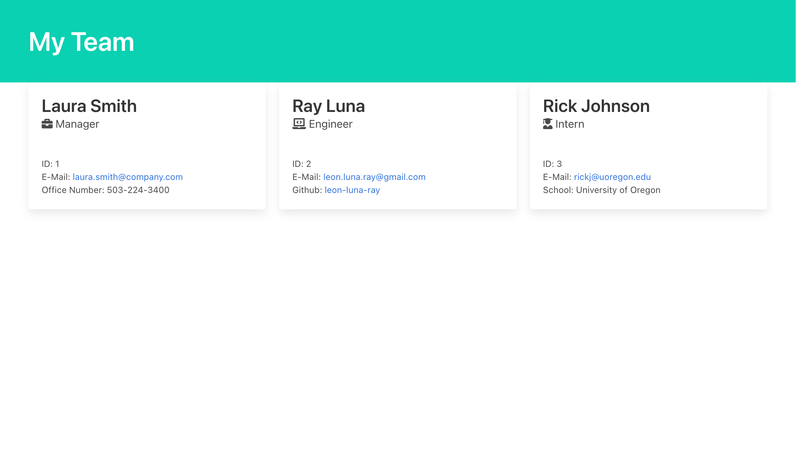

# Team Profile Generator

  ## Description

  A command line application for busy bosses to quickly render a styled team HTML page for quick access! The app will promt the end-user for thier contact information as well as their employees'. Once complete the app will generate a team.html file in the output folder containing everyone on the team.

  ## Usage

  The app is launched via command line with the command node app.js. You will need to have node installed on your machine and install the required dependencies before running the app. 

  ## Table of Contents

  * [Image](#image)
  * [Technologies](#technologies)
  * [Known-Bugs](#known-bugs)
  * [Next-Steps](#next-steps)
  * [License](#license)
  * [Contact](#contact)
  * [Links](#links)

  ## Images

  

  ## Technologies
  
  HTML, Bulma CSS, Font Awesome, Javascript, Node (npm: inquirer, jest)

  ## Known-Bugs

  Possible bug with CSS grid, working on getting cards on to next row.

  ## Next-Steps

  Add functionality to display a team name on the page and in the file name.

  ## License

  This project is licensed under the [MIT](https://opensource.org/licenses/MIT) license.
  

  ## Contact

  Author: Ray Luna 

  If you have any questions about the repo, open an issue or contact me directly at:
  - E-Mail: leon.luna.ray@gmail.com
  - GitHub: [leon-luna-ray](https://github.com/leon-luna-ray)

  ## Links

  - [Demo Video](https://youtu.be/_9L0reNTwvs) 

  - [Sample HTML File](https://github.com/leon-luna-ray/team-profile-generator/blob/master/output/team.html) 

  - [Project Repository](https://github.com/leon-luna-ray/team-profile-generator)

  